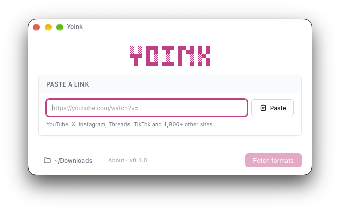
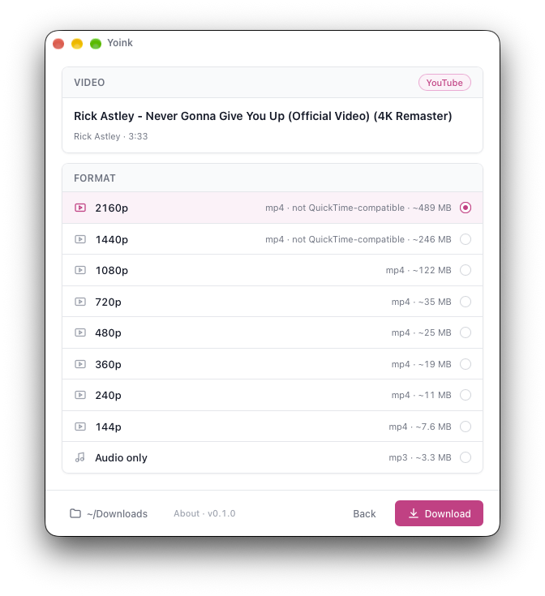
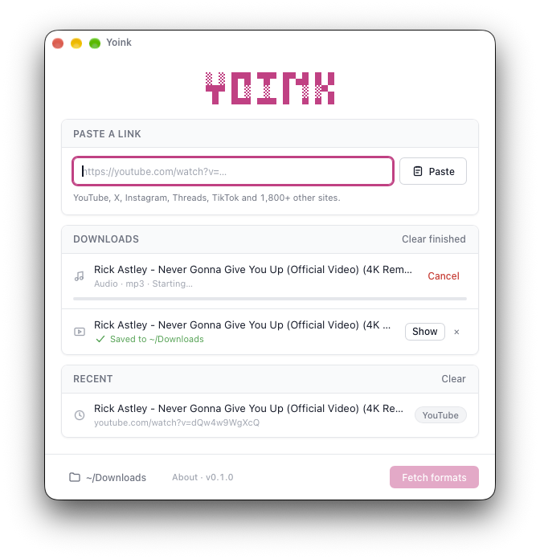
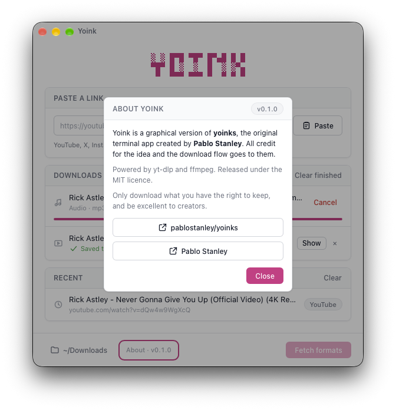

# yoinks, but with buttons 🖱️

<picture>
  <source media="(prefers-color-scheme: dark)" srcset="assets/logo-dark.svg">
  
</picture>

**A friendly little desktop and Android app for people who would rather not live in the terminal.**

Paste a link. Pick a quality. Yoink. Done. Now with a mouse.

<p align="center">
  
  
</p>

---

## Credit where it's due (this is the important bit)

**None of this is my idea. All of it is [Pablo Stanley](https://github.com/pablostanley)'s.**

[**yoinks**](https://github.com/pablostanley/yoinks) is Pablo's terminal app, and it is brilliant:
paste a URL, pick a resolution, and your video lands in your Downloads folder. No popups, no fake download
buttons, no sketchy redirects. The idea, the flow, the name, the look and feel, the choice of
[yt-dlp](https://github.com/yt-dlp/yt-dlp) under the hood: that's all Pablo. I just stood on the shoulders
of a very well-designed giant and bolted a window on the front.

This repo is a fork so that when Pablo ships improvements, I can pull them in and update the app to match.
Everything in the root of this repo (`src/`, `package.json`, and so on) is Pablo's original terminal app,
untouched. Everything in [`app/`](app) is the GUI I added.

**Go and star the original: [github.com/pablostanley/yoinks](https://github.com/pablostanley/yoinks)** ⭐

> Not affiliated with or endorsed by Pablo. I just really like his tool.

## Why does this exist?

Confession time: I'm **terminal-averse**. Terminal-shy. Command-line-curious but commitment-phobic.
A black box with a blinking cursor and no buttons makes me break out in a cold sweat.

Yoinks is awesome. I wanted it as a proper app, with a window, and things to click on. So I spent a couple
of hours vibing one into existence. Here it is.

## ⚠️ Full disclosure: this app is 100% vibe-coded

I didn't hand-write this. I described what I wanted, an AI ([Claude Code](https://claude.com/claude-code))
wrote it, I poked at the result, complained about the bits that were wrong, and repeated until it felt right.
That's the whole development process.

What that means for you:

- It works on my machine (an Apple Silicon Mac) and, with some luck, my phone.
- Nobody has audited it, and there are no tests beyond "I clicked it and it did the thing".
- If it eats your homework, that's on me, not Pablo.
- Pull requests and "have you considered not doing it this way" are welcome.

## What the app does

<p align="center">
  
  
</p>

- **Paste and go.** Paste a link anywhere on the first screen and it fetches straight away.
- **A sensible format list.** One row per resolution with an estimated size, plus audio-only mp3. If a video
  only comes in one quality, it just asks whether you want video with audio, or audio only.
- **QuickTime-friendly by default.** It prefers H.264 and AAC, so files play in QuickTime and Quick Look, not
  just VLC. (Above 1080p, YouTube only offers VP9/AV1, and those rows are labelled so you know what you're
  getting.)
- **Lots of downloads at once.** Start one, go back, paste another. They all run side by side in a list, each
  with its own progress bar and cancel button.
- **Recent links**, with proper titles, and a Clear button for when you'd rather forget.
- **Self-contained.** yt-dlp and ffmpeg are bundled inside the app, so a Mac with nothing installed can run it.
- **An Android version** you can sideload. Files land in `Download/Yoink`, and you get a notification when
  they finish.

It works with everything yt-dlp does: YouTube, X/Twitter, Instagram, Threads, TikTok and 1,800+ other sites.

### And for contrast, here's the original terminal version


Lovely, isn't it? It's also a terminal. 😅 (Seriously though: if the terminal doesn't scare you, use the
original. It's great.)

## Building it yourself

The GUI lives in [`app/`](app) and is built with [Tauri v2](https://tauri.app) (Rust) and React.

You'll need [Rust](https://rustup.rs), Node 18+ and Yarn 4 (`corepack enable`).

```sh
cd app
yarn install
yarn tauri:dev      # run it while hacking
yarn tauri:build    # builds Yoink.app (Apple Silicon or Intel, whichever you're on)
```

`yarn setup` (run for you by the commands above) downloads the yt-dlp and ffmpeg binaries the app bundles.
The finished app is in `app/src-tauri/target/release/bundle/macos/`.

For a universal build that runs on both Apple Silicon and Intel Macs:

```sh
yarn tauri:build:universal
```

**The app is unsigned**, so if you send it to someone, they'll need to right-click it and choose Open the
first time (or run `xattr -cr Yoink.app`).

### Android

You'll also need the Android SDK and NDK, and JDK 21.

```sh
cd app
export ANDROID_HOME=$HOME/Library/Android/sdk
export NDK_HOME=$ANDROID_HOME/ndk/<your-ndk-version>
export JAVA_HOME=/path/to/jdk-21
yarn tauri android build --debug --apk --target aarch64
```

The APK is written to `app/src-tauri/gen/android/app/build/outputs/apk/universal/debug/`. Copy it to your
phone and install it (you'll need to allow installs from unknown sources). On Android, yt-dlp, Python and
ffmpeg come from the [youtubedl-android](https://github.com/yausername/youtubedl-android) library.

## Keeping up with Pablo

This is why it's a fork. To pull in the latest changes from the original:

```sh
git fetch upstream
git merge upstream/main
```

The only file I expect to conflict is this README (keep mine). If Pablo changes how downloads work (the format
choices, the yt-dlp options), the matching logic in [`app/src/lib/ytdlp.ts`](app/src/lib/ytdlp.ts) and
[`app/src-tauri/src/desktop.rs`](app/src-tauri/src/desktop.rs) is where to update the app.

## A note on fair use

Same as the original: this is a personal-archiving tool. Downloading content may violate a platform's terms of
service, so only download what you have the right to keep, and be excellent to creators.

## Licence

[MIT](LICENSE), same as the original. Copyright Pablo Stanley, who made the thing this is all based on.
Thank you, Pablo. 🙏

---

<sub>Built with way too much enthusiasm and not nearly enough typing. Powered by <a href="https://github.com/yt-dlp/yt-dlp">yt-dlp</a>, <a href="https://ffmpeg.org">ffmpeg</a>, <a href="https://tauri.app">Tauri</a>, and a Claude that did all the hard work.</sub>
